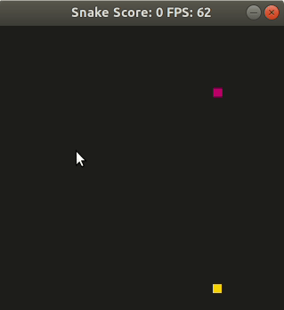

# CPPND: Capstone AI Snake Game

This is based on a starter repo for the Capstone project in the [Udacity C++ Nanodegree Program](https://www.udacity.com/course/c-plus-plus-nanodegree--nd213). The code for this repo was inspired by [this](https://codereview.stackexchange.com/questions/212296/snake-game-in-c-with-sdl) excellent StackOverflow post and set of responses.

This Snake Game features AI player on top of Capstone Snake Game. You can play normal Snake Game. But once you press the space bar, the AI player will take over your controller. See how good the AI plays. If you want to take control from AI player, you can press space bar again, or just start controlling with arrow keys. AI will give you the full control.

## Class Structure
* `Game` Class
    * AI needs to know where the food is. So In `Game::Run()` function, `controller.HandleInput()` call has been modified to pass `food` as well as `running` and `snake`.
* `Snake` Class
    * `bool _ai` private member variable has been added to indicate if the snake is AI enabled or not.
    * To access private member variabl e`_ai`, `bool isAIEnabled()` and `void setAI(bool ai)` has been added. When switching `_ai`, debugging messages are printed to console.
    * AI in `Controller` class needs to know `grid_width` and `grid_height`, which is a private member variable. So getter for those items, `int getGridWidth()` and `int getGridHeight()`, are added.
* `Renderer` Class
    * In `Render()` function, the color of snake head is changed to Pink, `#CC006D`, when AI is enabled.
* `Controller` Class
    * `HandleInput()`
      * This function has been modified to receive `food`. Since the AI needs to know where the food is to decide next move.
      * If AI is enabled, it calls `ControlAI()` to control with AI.
      * If space bar has entered, it toggles AI.
      * If there is user input, arrow keys, it disables AI.
    * `void ControlAI()`
        * This function sets direction of snake for next move.
        * It tests current direction with `TestMove()` function. If it is okay, then AI does nothing. Otherwise, it tests left and right move respectively and choose from the result.
    * `bool TestMove()`
        * With the given direction, it estimates next position and see if it collides.
        * It returns false if it collides. Otherwise, it continues calculating distance between food.
        * If the distance between food gets closer, it returns true. If not, it returns false.

## Rubrics
* Loops, Functions, I/O
    * The project demonstrates an understanding of C++ functions and control structures.
        * `Controller::ControlAI()` uses `switch-case` control structures.
    * The project accepts user input and processes the input.
        * `Controller::HandleInput()` accepts user input space bar, and process it to toggle AI mode.
* Object Oriented Programming
    * The project uses Object Oriented Programming techniques.
        * Class attributes and class methods of `Snake` and `Controller` classes are modified and newly defined.
    * Classes use appropriate access specifiers for class members.
        * `Controller::ControlAI()` and `Controller::TestMove()` functions are only used in `Controller` object. So it is defined private.
    * Classes encapsulate behavior.
        * To access `_ai` from `Snake`, `bool isAIEnabled()` and  `void setAI(bool ai)` has been added.
* Memory Management
    * The project makes use of references in function declarations.
        * Newly defined functions `Controller::ControlAI()` and `Controller::TestMove()` takes advantage of pass-by-refence.

## Dependencies for Running Locally
* cmake >= 3.7
  * All OSes: [click here for installation instructions](https://cmake.org/install/)
* make >= 4.1 (Linux, Mac), 3.81 (Windows)
  * Linux: make is installed by default on most Linux distros
  * Mac: [install Xcode command line tools to get make](https://developer.apple.com/xcode/features/)
  * Windows: [Click here for installation instructions](http://gnuwin32.sourceforge.net/packages/make.htm)
* SDL2 >= 2.0
  * All installation instructions can be found [here](https://wiki.libsdl.org/Installation)
  * Note that for Linux, an `apt` or `apt-get` installation is preferred to building from source.
* gcc/g++ >= 5.4
  * Linux: gcc / g++ is installed by default on most Linux distros
  * Mac: same deal as make - [install Xcode command line tools](https://developer.apple.com/xcode/features/)
  * Windows: recommend using [MinGW](http://www.mingw.org/)

## Basic Build Instructions

1. Clone this repo.
2. Make a build directory in the top level directory: `mkdir build && cd build`
3. Compile: `cmake .. && make`
4. Run it: `./SnakeGame`.
